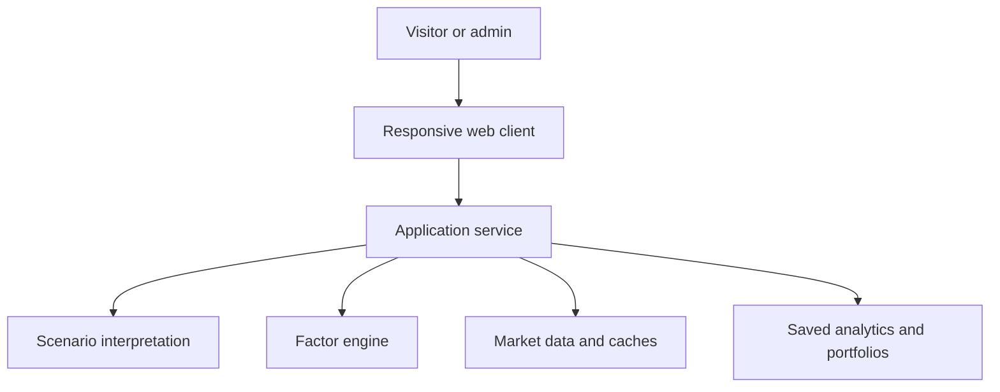

# nami

[](LICENSE)
[](https://github.com/ignitesplash101/nami/actions/workflows/ci.yml)
[](pyproject.toml)
[](docs/llm-system-design.md)

**波** — an evidence-aware scenario explorer for equity portfolios.

**[🚀 Live demo →](https://nami-wy4mdlp7hq-an.a.run.app)** · Visitor mode runs sample scenarios against sample portfolios with no signup. Free-text scenarios, custom portfolios, backdating, and saved analytics require an admin passcode.

Describe a hypothetical market shock in natural language. Nami turns it into a
transparent, portfolio-level impact analysis built from cited evidence, historical
analogs, structured factor shocks, and deterministic quantitative attribution.

The language model interprets the scenario; it does **not** calculate portfolio
returns. Every headline result comes from an inspectable factor engine and is paired
with its evidence, uncertainty surfaces, fit diagnostics, and reproducibility metadata.

The name *nami* (波) is Japanese for "wave" — markets move in waves, factor shocks propagate in waves, and the workbench separates systematic drivers from idiosyncratic name shocks and scenario-theme sensitivity.

### Start here

- **[Methodology](docs/methodology.md)** — factor universe, estimation, attribution, backdating, and references
- **[System design](docs/llm-system-design.md)** — grounded interpretation, structured extraction, versioning, and semantic evals
- **[Validation](docs/engine-replay-validation.md)** — modeled-versus-realized tracking across the event and sample-book matrix
- **[Backdated case studies](docs/backdated-case-studies.md)** — known regimes replayed with explicit no-look-ahead controls
- **[Feature tour](docs/feature-tour.md)** — portfolio analytics, evidence surfaces, workflow, accessibility, and operations

---

## ⚠️ Disclaimer

This is an **educational and research tool**. It is **not investment advice**, **not regulatory stress testing**, and **not a substitute for institutional risk management**. Scenario outputs are hypothetical modeled stress outcomes, not forecasts or predictions. Do not use outputs for actual trading, risk capital, or compliance decisions.

---

## How it works

Given a portfolio (sample or custom) and a natural-language hypothetical stress ("60% tariffs on China imports, prolonged trade war"), nami:

1. **Picks historical analogs.** Gemini selects 2–5 events from a curated registry of 31 market-stress events whose mechanism matches the scenario.
2. **Computes an empirical envelope.** For each analog, nami pulls the realized factor returns over the event window from yfinance. Across the analogs it returns per-factor mean / p10 / p90 / count — the band the LLM's proposed shocks must stay inside.
3. **Grounds a narrative.** A second Gemini call runs with Google Search active and produces a 3-5 sentence hypothetical stress narrative, citing real recent news. Without citations, the pipeline refuses to return.
4. **Extracts structured shocks.** A schema-bound third call translates the narrative into a `FactorShock` list (for the 26-factor universe — market/sector/style plus rates, dollar, vol, oil, high-yield credit, gold, and short Treasuries) and a `PeripheryShock` list (idiosyncratic, ticker-level, hard-banded to ±75%). Shocks are defined as cumulative total moves over the stress episode — the prompt states the units/horizon contract explicitly and shows per-analog returns with window lengths, not just the envelope band.
5. **Computes portfolio P&L + attribution.** Standardized (unit-variance) ridge OLS estimates the portfolio's factor betas on 3 years of weekly returns (per-ticker NaN masks, 40-week history floor, per-name R²/idio-vol fit stats surfaced on the result; non-USD listings are converted to USD returns first). The main workbench exposes the practical production views:
   - **Scenario shocks**: production risk view restricted to factors explicitly shocked by the scenario; unshocked factors stay at zero.
   - **Group totals**: risk-committee view that renders true market / sector / style / macro waterfall totals, with factor-level detail below.
   - **Advanced diagnostics**: `Naive algebra` and `Full conditional diagnostic` stay available for audit/debug. Full conditional is correlation credit, non-causal, and never drives the headline.

Every saved result carries full reproducibility metadata (model id, prompt version, factor-universe version, events version, ridge α, lookback weeks, selected event ids, exact holdings, both requested and effective as-of dates) so any record can be re-rendered later without consulting live state.

## What makes it different

- **Evidence before confidence.** Proposed shocks are bounded by realized historical
  analogs, while unsupported factors and weak fits are disclosed rather than hidden.
- **Deterministic portfolio math.** The language-model layer interprets scenarios;
  regression, P&L, attribution, benchmarks, and replay calculations remain testable code.
- **Uncertainty in the answer layer.** The headline sits beside severity bounds,
  idiosyncratic dispersion, analog replay ranges, and model-fit warnings.
- **No-look-ahead workflows.** Backdated runs filter the available evidence and prices
  to the requested date and clearly disclose the remaining model-vintage limitation.
- **Reproducible records.** Saved analyses carry their holdings, analogs, versions,
  effective dates, and engine settings so they can be reconstructed later.
- **Product, not notebook.** Responsive interaction, accessible controls, streaming
  progress, exports, operational guardrails, and automated release checks are built in.

See the **[complete feature tour](docs/feature-tour.md)** for the portfolio analytics,
validation surfaces, analyst workflows, and production controls behind the demo.

## Tech stack

- **Python 3.12** + **FastAPI** backend
- **React + TypeScript + Vite + Plotly.js** frontend (`frontend/`)
- **Vertex AI / Gemini 3.6 Flash** for the LLM calls (3 sub-calls per scenario)
- **yfinance** for historical price data, cached in **Google Cloud Storage** (parquet) with 24-hour TTL
- **GCS** also holds the scenario response cache (JSON, 7-day TTL — the de-dup layer)
- **Firestore** (added Phase 11) for saved scenarios, named portfolios, dated snapshots, plus daily usage/budget counters, the auth-throttle, and the audit log
- **slowapi** for per-IP rate limiting; optional **Sentry** for error tracking (no-op unless `SENTRY_DSN` is set)
- **Cloud Run** for the deployed app, with **Secret Manager** for the admin passcode and **Cloud Build** (`nami-main-push` trigger) for CI/CD

Region split: Cloud Run + GCS + Firestore + Artifact Registry in `asia-northeast1`; Vertex AI (Gemini 3.6 Flash) in `global` (this model is multi-region only — `global`, `us` or `eu`, never a single region like `asia-northeast1`).

## Visitor vs admin

The deployed app is publicly viewable. Visitor mode allows running curated sample scenarios or custom stress text against sample portfolios only — enough to demo the engine without exposing custom holdings, backdating, MTM, saved analytics, or other admin-only workflows to the open internet.

Admin mode is unlocked by a passcode stored in Secret Manager (`nami-passcode:latest`). Admin enables: custom portfolio uploads, benchmark overrides, slider/prompt shock adjustments, fixed-context theme sensitivity (experimental 2^N subset Shapley), backdated as-of dates, saved-scenario library, and dated-portfolio snapshots.

## Architecture overview



The engine code is structured for swappability: `app/data/market.py` is the one file that would change to migrate yfinance → Polygon; `app/data/cache.py` `CacheProtocol` lets tests inject an `InMemoryCache`; `app/data/firestore_store.py` exports an `InMemoryFirestoreStore` test double.

## Repository layout

```
app/
├── api/                   FastAPI endpoints, auth, schemas
├── data/                  market data + caches (GCS + Firestore)
├── factors/               factor universe, regression, shocks, attribution, analog matcher
├── llm/                   Gemini client, prompts, scenario orchestrator, narrative Shapley
└── utils/                 calendar, disclaimers, hashing
frontend/
└── src/                   React app — components, hooks (useOverlay, useMediaQuery), api client
tests/                     pytest suite — 120+ tests including invariant-only worked example
docs/
├── methodology.md         engine math, attribution variants, backdating, references
├── feature-tour.md        detailed product and workflow inventory
└── engine-replay-validation.md
                           modeled-versus-realized engine evidence
data/
└── historical_events.yaml curated event registry
```

## Local development

```bash
git clone https://github.com/ignitesplash101/nami
cd nami
uv sync                          # install Python deps
cp .env.example .env             # fill in GOOGLE_CLOUD_PROJECT, VERTEX_AI_LOCATION, GCS_BUCKET, PASSCODE

# Backend
uv run uvicorn app.api.main:api --reload --host 0.0.0.0 --port 8080

# Frontend (separate terminal)
cd frontend
npm install
npm run dev                      # Vite dev server on localhost:5173
```

The dev frontend proxies API calls to `localhost:8080`. To exercise the full pipeline including Firestore-backed saving you need a GCP project with Firestore enabled and the service account configured — see "Deploying to Cloud Run" below.

### Test suite

```bash
uv run pytest tests/ -v           # 120+ tests; live-LLM evals are network-gated
uv run ruff check .
uv run black --check .
cd frontend && npm test -- --run  # vitest + RTL
cd frontend && npm run build      # TypeScript + Vite production build
cd frontend && npm run bundle:check # gzip release budgets (run after build)
cd frontend && npm run e2e        # mocked responsive browser release suite
```

Live-LLM evaluation tests are gated on `RUN_NETWORK_TESTS=1` (cost ~$0.08 each).
If a long-lived local `.venv` has a stale `black` entrypoint, verify formatting with
`uvx --python 3.12 --from black black --check .`, which matches a fresh CI install.

## Deploying to Cloud Run

Cloud Build trigger `nami-main-push` rebuilds + redeploys on every push to `main`. One-time setup per GCP project:

```bash
# 1. Service account
gcloud iam service-accounts create nami-sa --display-name="nami runtime"
gcloud projects add-iam-policy-binding $PROJECT_ID \
    --member="serviceAccount:nami-sa@$PROJECT_ID.iam.gserviceaccount.com" \
    --role="roles/aiplatform.user"
gcloud projects add-iam-policy-binding $PROJECT_ID \
    --member="serviceAccount:nami-sa@$PROJECT_ID.iam.gserviceaccount.com" \
    --role="roles/storage.objectAdmin"
gcloud projects add-iam-policy-binding $PROJECT_ID \
    --member="serviceAccount:nami-sa@$PROJECT_ID.iam.gserviceaccount.com" \
    --role="roles/secretmanager.secretAccessor"

# 2. Firestore (added Phase 11 — required for saved analytics)
gcloud firestore databases create --location=asia-northeast1 --type=firestore-native
gcloud projects add-iam-policy-binding $PROJECT_ID \
    --member="serviceAccount:nami-sa@$PROJECT_ID.iam.gserviceaccount.com" \
    --role="roles/datastore.user"

# Composite index for tag-filtered scenario listing
gcloud firestore indexes composite create \
    --collection-group=saved_scenarios \
    --field-config=field-path=tags,array-config=contains \
    --field-config=field-path=created_at,order=descending

# 3. Buckets + secrets
gsutil mb -l asia-northeast1 gs://nami-cache-$PROJECT_ID
echo -n 'your-passcode' | gcloud secrets create nami-passcode --data-file=-

# 4. Cloud Build trigger (one-time, via console or gcloud builds triggers create)
```

Then push to main and the trigger handles the rest.

## Design choices worth knowing

- **Attribution has product tiers.** The headline uses **Scenario shocks** when available; **Group totals** is the secondary risk-committee view. Periphery is a separate idiosyncratic overlay and material gross periphery is surfaced by ticker in the waterfall. `Naive algebra` and `Full conditional diagnostic` are advanced diagnostics only. Full conditional is data-dependent correlation credit under the historical conditional distribution, not causal attribution.
- **Backdating is data-vintage-controlled, not model-vintage-controlled.** Events, factor history, and prices are strictly filtered to `≤ as_of`. The LLM's parametric knowledge is NOT — it still "knows" about COVID even when as_of is 2018. The UI banner makes this honest.
- **`temperature=0` everywhere.** Same scenario + same portfolio + same effective as-of date + same prompt version + same model = same shocks, byte-for-byte cached.
- **Two cache-invalidation levers.** `PROMPT_VERSION` (currently v11) bumps with any change to prompt semantics OR `ScenarioResult` shape; the `regression_spec` cache-key component (estimator id + lookback + alpha + min_obs) self-invalidates on any engine-math or regression-config change. Post-cache overlays (mark-to-market, benchmark/active return) and display-only fields bump neither — they're attached after retrieval and never persisted.
- **Shocks are episode total returns; betas are weekly.** The extraction prompt defines a shock as the cumulative move over the full stress episode (the selected analogs set the implied horizon) and the linear engine applies weekly betas to it under an explicit horizon-invariance assumption — documented honestly in `docs/methodology.md` ("Shock horizon and units"), including the no-clamp-below-−100% policy with its warning diagnostic.
- **Sample portfolios are cap-weighted from a frozen, dated snapshot.** `app/data/sample_portfolio_weights.json` holds committed cap-weights + sector/country tags, regenerated offline by `scripts/refresh_sample_weights.py`. The runtime never scrapes, so weights can't drift and poison the cache.
- **Benchmark & active return are a non-cached overlay.** Each book carries a benchmark ticker (sample books built-in; custom books optional); the benchmark computes total P&L and naive attribution only, then attaches `active_return = portfolio − benchmark` post-cache. Benchmark conditional-attribution maps are intentionally `null`.
- **Historical-event returns have a separate 30-day persistent cache.** The complete events × factors parquet is keyed by the event registry, factor universe, and market-cache versions. Scenario runs reuse selected rows when present and fetch only selected events on a full-cache miss, so a normal run never waits for all registry events.
- **`CASH` is a zero-exposure sentinel.** A cash sleeve is never fetched from yfinance, carries a zero-beta/zero-return row (its weight dilutes the rest), and in MTM mode a `CASH` quantity is a USD amount marked at 1.0. An all-cash book is rejected (nothing to shock).
- **Saved records are self-contained.** Inline holdings, inline analog event details, inline result, inline reproducibility metadata. A saved scenario doesn't depend on the live event registry or the GCS cache TTL.
- **Engine changes are evidence-gated.** Every proposed estimator change runs as an experiment against the LLM-free engine-replay harness (`docs/engine-replay-validation.md`) and is adopted only if tracking error improves without correlation degradation. Three candidates have been evaluated and rejected on that bar so far — a heavier ridge alpha, a Dimson lead/lag correction, and stress-conditional (downside-weighted / informative-prior) betas — each with a dated decision record in `docs/methodology.md`.

## License

MIT — see [LICENSE](LICENSE). Copyright (c) 2026 ignitesplash101.

## Maintainer

Ryan Seet — Risk Implementation, Tokyo
Not affiliated with any employer; built independently as an educational portfolio piece.
